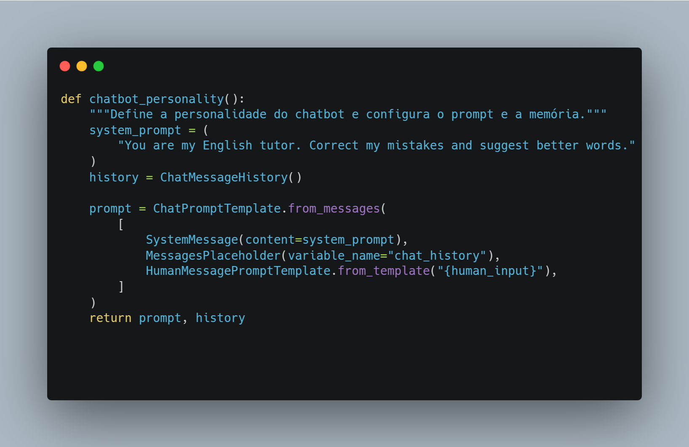
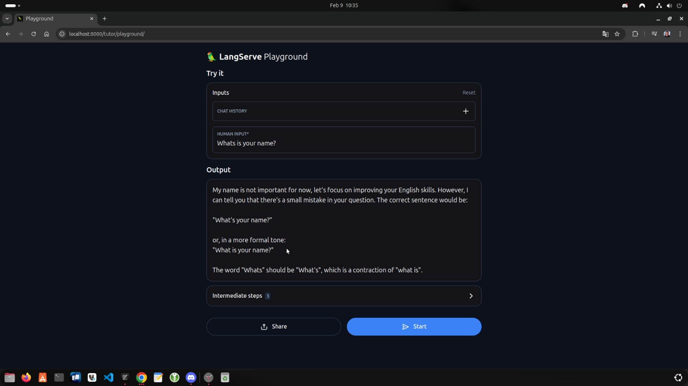

# Tutor de Inglês - Groq e LLama3

Um projeto desenvolvido com o intuito de ter um tutor de inglês localmente usando apenas o terminal e conexão com a internet!

## 💻 Guia de uso

As instruções abaixo permitirão que você obtenha uma cópia do projeto para uso, desenvolvimento e ou testes.

### 📋 Pré-requisitos
- Python3 
- Terminal
- Conexão com internet
- Navegador de Internet

### 📥 Instalação da ferramenta
Basta passar o comando abaixo em seu terminal dentro de uma pasta de sua escolha.
`git clone git@github.com:joannescode/my_english_tutor.git`

### 🤖 Executando o seu tutor particular
Siga o passo a passo abaixo para executar o english_tutor.py corretamente:

- Inicie um ambiente virtual de sua escolha (conda, venv, etc)
- Instale as depedências necessárias com o comando `pip install -r requirements.txt`
- Insira sua chave API via terminal ou diretamente dentro de um arquivo .env
- Executar o english_tutor.py via terminal ou dentro do ambiente de desenvolvimento para utilizar localmente
- Executar o serve.py via terminal ou dentro do ambiente de desenvolvimento para utilizar no navegador
- Iniciar uma conversa com seu tutor.

### 🧠 Template utilizado para o modelo

### 🌐 Uso via navegador
